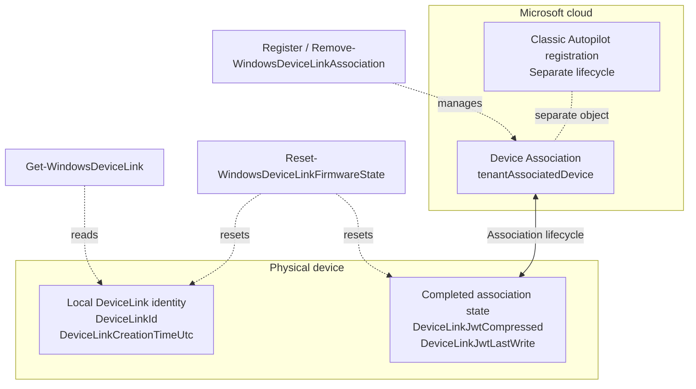

# DeviceLink firmware state

WindowsDeviceLink can inspect and reset the local firmware state used by Windows Autopilot Device Preparation Device Association.

This functionality is separate from the server-side `tenantAssociatedDevices` record in Microsoft Intune.

## Where the state lives



Classic Autopilot registration, tenant-side Device Association, and local Device Link firmware state are separate lifecycle objects.

## UEFI namespace

Validated namespace:

```text
{B3DE75DA-819C-4FD5-9F01-C3D49E8CBBD7}
```

Validated variables:

```text
DeviceLinkId
DeviceLinkJwtCompressed
DeviceLinkJwtLastWrite
DeviceLinkCreationTimeUtc
```

Do not log or publish the raw contents of `DeviceLinkJwtCompressed`.

## Read firmware state

```powershell
Get-WindowsDeviceLinkFirmwareState
```

The cmdlet returns safe metadata only:

- environment (`Windows` or `WindowsPE`);
- variable name;
- presence;
- byte size;
- Win32 error when a variable is not readable/present.

Example:

```powershell
Get-WindowsDeviceLinkFirmwareState |
    Format-Table Name,Present,Size,LastError
```

A missing variable normally returns `Present = False` with Win32 error `203` (`ERROR_ENVVAR_NOT_FOUND`).

## Reset local firmware state

```powershell
Reset-WindowsDeviceLinkFirmwareState
```

The cmdlet removes all four known DeviceLink UEFI variables and immediately verifies that they are absent. This resets the current local DeviceLink identity/association firmware state.

It does not remove:

- the Intune Device Association record;
- the Intune managed-device record;
- the Entra ID device;
- TPM ownership;
- classic Autopilot V1 registration.

For controlled automation or WinPE:

```powershell
Reset-WindowsDeviceLinkFirmwareState -Confirm:$false -PassThru
```

To preview the operation:

```powershell
Reset-WindowsDeviceLinkFirmwareState -WhatIf
```

> [!IMPORTANT]
> A reset does not mean that every DeviceLink variable remains permanently absent. Current testing shows that a reboot alone can leave the device at **0/4**. A later DeviceLink identity retrieval (for example, `Get-WindowsDeviceLink`) can materialize a **new** `DeviceLinkId` and `DeviceLinkCreationTimeUtc`, returning the device to the base **2/4** state. The old identity is not restored.

## Server-side removal is separate

Use:

```powershell
Remove-WindowsDeviceLinkAssociation `
    -SerialNumber '<serial-number>' `
    -Method DeviceCode `
    -TenantId '<tenant-id>'
```

for the server-side Intune/Graph record.

For a fully associated device, a complete decommissioning or tenant-move workflow can require both:

1. remove the server-side Device Association record;
2. reset the local DeviceLink firmware state.

Keep these operations separate unless the caller intentionally combines them.

## Validated lifecycle observations

Testing on physical AMD64 hardware confirmed the following behavior.

### Clean device

All four variables were absent.

### DeviceLink generation

After generating DeviceLink information, the following local variables existed:

```text
DeviceLinkId
DeviceLinkCreationTimeUtc
```

The JWT variables were not present yet.

### Preassociation

Creating the server-side preassociation did not add the JWT variables. Local state remained the DeviceLink identity state above.

### Fully associated device

A fully associated device contained all four variables:

```text
DeviceLinkId
DeviceLinkJwtCompressed
DeviceLinkJwtLastWrite
DeviceLinkCreationTimeUtc
```

### Server-side deletion

Deleting the `tenantAssociatedDevices` record did not remove the local firmware variables.

### Local reset

Removing all four variables succeeded in both full Windows and AMD64 WinPE and was verified immediately afterward. All four returned `Present = False` and Win32 error `203`.

### New identity after reset

Controlled testing established the reset behavior more precisely:

1. the server-side Device Association record was removed;
2. Intune showed no Device Association record for the device;
3. all four local DeviceLink UEFI variables were reset and immediately verified absent;
4. the device was rebooted into full Windows;
5. a post-boot firmware check still showed **0/4**;
6. `Get-WindowsDeviceLink` was then invoked;
7. immediately afterward, `DeviceLinkId` and `DeviceLinkCreationTimeUtc` were present again, while both JWT variables remained absent;
8. the resulting state was therefore the base **2/4** identity state.

This demonstrates that reset removes the old local DeviceLink identity. A reboot alone does not necessarily recreate the base identity. A later DeviceLink identity retrieval can materialize a **new** base identity. The presence of `DeviceLinkId` and `DeviceLinkCreationTimeUtc` alone must not be interpreted as restoration of the old identity or proof of an active tenant association.

In the validated fully associated state, the two JWT-related variables were also present. Their exact semantics should not be inferred beyond the observed lifecycle behavior without additional Microsoft documentation or testing.

## Windows PE

The same native firmware read/write mechanism was validated successfully in AMD64 Windows PE.

Validated in WinPE:

- firmware state read;
- DeviceLink generation;
- Graph preassociation;
- Graph Device Association removal;
- firmware reset;
- verification that all known firmware variables were absent afterward.

Windows PE therefore provides a useful control point for reinstallation and tenant-to-tenant migration workflows. A subsequent full Windows boot can create a new base DeviceLink identity as described above.

## Privilege requirement

Firmware access requires `SeSystemEnvironmentPrivilege`. WindowsDeviceLink enables this privilege in the current process when the firmware cmdlets run. Use an elevated Windows PowerShell session.

## Safety

- Do not reset unrelated UEFI variables.
- Do not expose the raw JWT-compressed value in logs.
- Use `-WhatIf` / confirmation behavior for destructive operations where appropriate.
- Treat server-side removal and local firmware reset as separate lifecycle operations.
- Do not treat `DeviceLinkId` or `DeviceLinkCreationTimeUtc` alone as evidence of an active tenant association.
- Expect a new base DeviceLink identity to be materialized when DeviceLink identity retrieval is invoked after reset; reboot alone may leave the device at 0/4.
