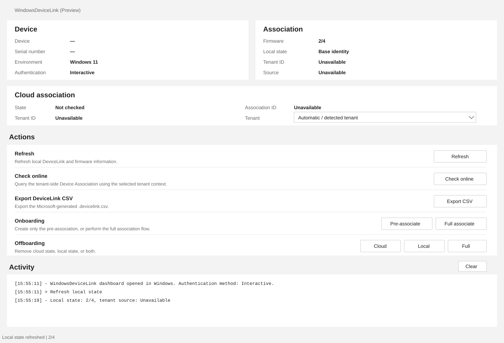

# WindowsDeviceLink operator GUI

`Show-WindowsDeviceLink` opens a compact operator dashboard for inspecting and managing Windows Autopilot device preparation Device Association.



> The image above uses sanitized example data. Device name and serial number are intentionally omitted.

## Start the GUI

On full Windows:

```powershell
Show-WindowsDeviceLink
```

On full Windows, `Interactive` authentication is used by default unless `-Method` is specified.

On Windows PE, `DeviceCode` is used by default because interactive browser authentication is not available there.

## Authentication

Select an authentication method with `-Method`.

| Method | Typical parameters |
|---|---|
| `Interactive` | Optional `-TenantId`, optional `-ClientId` |
| `DeviceCode` | Optional `-TenantId`, optional `-ClientId` |
| `ClientSecret` | `-TenantId`, `-ClientId`, `-ClientSecret` |
| `AccessToken` | `-AccessToken`; `-TenantId` can be supplied when needed |
| `Certificate` | `-TenantId`, `-ClientId`, `-Certificate`; optional `-SendCertificateChain` |
| `CertificateThumbprint` | `-TenantId`, `-ClientId`, `-CertificateThumbprint`; optional `-SendCertificateChain` |
| `CertificateSubjectName` | `-TenantId`, `-ClientId`, `-CertificateSubjectName`; optional `-SendCertificateChain` |
| `EnvironmentVariable` | Uses the documented Azure/Entra environment variables |
| `ManagedIdentity` | Optional `-ClientId` for a user-assigned identity |

Examples:

```powershell
Show-WindowsDeviceLink -Method Interactive
```

```powershell
Show-WindowsDeviceLink `
    -Method DeviceCode `
    -TenantId '<tenant-id>'
```

```powershell
$secret = Read-Host 'Client secret' -AsSecureString

Show-WindowsDeviceLink `
    -Method ClientSecret `
    -TenantId '<tenant-id>' `
    -ClientId '<client-id>' `
    -ClientSecret $secret
```

The GUI does not introduce a separate authentication implementation. Online actions delegate to the existing WindowsDeviceLink cmdlets using the selected authentication parameters.

## Tenant selection

### Single tenant

Use `-TenantId` when the GUI should use one explicit tenant:

```powershell
Show-WindowsDeviceLink -TenantId '<tenant-id>'
```

The selector displays **Default tenant parameter**.

When no explicit tenant is supplied, the selector displays **Automatic / detected tenant** and WindowsDeviceLink can use the current/local tenant context where the delegated operation supports it.

### Friendly tenant list

```powershell
Show-WindowsDeviceLink -Tenants @{
    'Management' = '11111111-1111-1111-1111-111111111111'
    'Customer A' = '22222222-2222-2222-2222-222222222222'
    'Customer B' = '33333333-3333-3333-3333-333333333333'
}
```

### Local JSON

```powershell
Show-WindowsDeviceLink `
    -TenantsPath 'E:\Config\tenants.json'
```

### HTTPS JSON

```powershell
Show-WindowsDeviceLink `
    -TenantsUri 'https://config.example.com/windowsdevicelink/tenants.json'
```

Both JSON options use the same simple schema:

```json
{
  "Management": "11111111-1111-1111-1111-111111111111",
  "Customer A": "22222222-2222-2222-2222-222222222222",
  "Customer B": "33333333-3333-3333-3333-333333333333"
}
```

`-TenantsUri` accepts only an absolute HTTPS URI. Tenant values must be valid GUIDs. These files should contain names and tenant IDs only; do not store credentials or secrets in them.

When multiple tenant sources are supplied, precedence is:

```text
TenantsUri -> TenantsPath -> Tenants
```

Explicit `-Tenants` values therefore have the highest priority for duplicate names.

## Windows 11 and Windows PE

| Capability | Windows 11 | Windows PE |
|---|---|---|
| Local DeviceLink / firmware inspection | Yes | Yes |
| Tenant-side online lookup | Yes | Yes, when authentication/network prerequisites are available |
| DeviceLink CSV export | Yes | Yes |
| Pre-associate | Yes | Yes |
| Full associate | Yes | No; use pre-association and let full Windows/OOBE complete Device Association |
| Cloud offboard | Yes | Yes |
| Local offboard | Yes | Yes |
| Full offboard | Yes | Yes, when cloud authentication/network prerequisites are available |
| Default GUI authentication | `Interactive` | `DeviceCode` |
| DeviceLink runtime | Registered Windows runtime | Administrator-supplied compatible runtime may be required |

### Windows PE runtime DLL

WindowsDeviceLink does **not** redistribute Microsoft's `Windows.Management.Service.dll`.

When the compatible runtime DLL is not available from the documented module runtime location, provide it explicitly:

```powershell
Show-WindowsDeviceLink `
    -WindowsManagementServicePath 'E:\Windows.Management.Service.dll'
```

The same parameter can be combined with tenant and authentication options:

```powershell
Show-WindowsDeviceLink `
    -WindowsManagementServicePath 'E:\Windows.Management.Service.dll' `
    -TenantsPath 'E:\Config\tenants.json'
```

The DLL must come from an administrator-controlled compatible Windows source. See [INSTALLATION.md](INSTALLATION.md) and [WINPE-WORKFLOW.md](WINPE-WORKFLOW.md) for the validated WinPE workflow and support boundary.

## Actions

- **Refresh** — refresh local DeviceLink and firmware information.
- **Check online** — query tenant-side Device Association state using the selected tenant context.
- **Export CSV** — export the Microsoft-generated DeviceLink CSV.
- **Pre-associate** — create only the tenant-side pre-association.
- **Full associate** — ensure pre-association exists and perform the full association flow on supported full Windows.
- **Cloud offboard** — remove only the tenant-side Device Association record.
- **Local offboard** — reset only local DeviceLink firmware state.
- **Full offboard** — verify/remove cloud state first, then reset local DeviceLink firmware state.

State-changing actions delegate to the existing guarded public cmdlets and retain their safety behavior.

## Activity log

The Activity pane shows the delegated command, authentication progress, important lifecycle phases, compact result fields and final status.

Large nested status objects are intentionally omitted from the normal GUI activity view. Use the CLI diagnostics when complete object output is required.