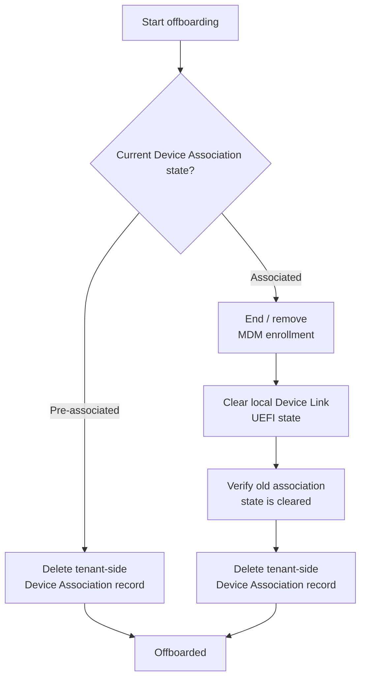
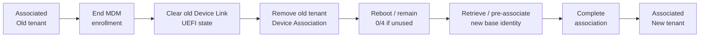

# Device Association offboarding

Use this workflow when a device permanently leaves the tenant, is decommissioned, or must be prepared for ownership by another organization.

The required cleanup depends on whether the device is still **Pre-associated** or has already become **Associated**.

> [!IMPORTANT]
> Device Association is separate from classic Windows Autopilot registration. This workflow removes Windows Autopilot device preparation **Device Association** state. It does not remove a classic Autopilot hardware-hash registration.

## Decision flow



## Pre-associated device

A **Pre-associated** device has a tenant-side Device Association record, but association has not yet completed on the device.

Typical state:

```text
Firmware: 2/4
Cloud Device Association: preassociated
```

No trusted tenant affinity has been written to the completed Device Link UEFI association state yet.

Offboarding is therefore simply:

```text
Delete Device Association record -> Done
```

With WindowsDeviceLink:

```powershell
Remove-WindowsDeviceLinkAssociation -Method Interactive
```

When no `-SerialNumber` or `-AssociationId` is supplied, the cmdlet uses the serial number of the local machine. `Interactive` authentication can use the tenant selected by the sign-in context. Specify `-TenantId` when an explicit tenant must be targeted, such as a multitenant workflow.

The same operation can also be performed from:

```text
Intune admin center
-> Devices
-> Enrollment
-> Device association
-> Devices
-> Delete
```

## Associated device

An **Associated** device has completed Device Association. Trusted tenant affinity is stored locally in UEFI and survives Windows reset, reinstall, and enrollment removal.

Typical state:

```text
Firmware: 4/4
Cloud Device Association: associated
JWT: present
```

Deleting only the Device Association record from Intune is therefore **not sufficient**.

### 1. Remove MDM enrollment

As part of the normal decommissioning process, first ensure that the device is no longer enrolled with its MDM provider.

If the device remains enrolled, the MDM provider can attempt to associate it again on a subsequent check-in.

### 2. Clear the local Device Link UEFI state

Use:

```powershell
Reset-WindowsDeviceLinkFirmwareState -Confirm:$false -PassThru
```

WindowsDeviceLink clears the four known Device Link variables in namespace:

```text
{B3DE75DA-819C-4FD5-9F01-C3D49E8CBBD7}
```

Variables:

```text
DeviceLinkId
DeviceLinkJwtCompressed
DeviceLinkJwtLastWrite
DeviceLinkCreationTimeUtc
```

Immediately after a successful reset, all four should be absent:

```text
Firmware: 0/4
```

> [!NOTE]
> A reboot alone may leave the device at 0/4. A later Device Link identity retrieval, such as `Get-WindowsDeviceLink`, can materialize a new base identity (2/4). Seeing `DeviceLinkId` and `DeviceLinkCreationTimeUtc` return later does not mean the old tenant association was restored.

### 3. Delete the tenant-side Device Association record

After local association information has been cleared:

```powershell
Remove-WindowsDeviceLinkAssociation -Method Interactive
```

Or delete the device from:

```text
Intune admin center
-> Devices
-> Enrollment
-> Device association
-> Devices
-> Delete
```

## Associated-device flow


## What the firmware reset does not remove

Clearing Device Link UEFI state does not by itself remove:

- the Intune managed-device record;
- the Microsoft Entra ID device;
- TPM ownership;
- classic Windows Autopilot registration;
- the tenant-side Device Association record.

Those are separate lifecycle objects.

## Windows reset or reinstall is not offboarding

The tenant affinity of an associated device is stored in UEFI and can persist across:

- Windows reset;
- Windows reinstall;
- removal of Windows enrollment.

Do not use an OS reset or reinstall as a substitute for Device Association offboarding.

## Tenant move

A tenant move uses the same cleanup boundary:



See [FIRMWARE-STATE.md](FIRMWARE-STATE.md) for firmware behavior and [REMOVE-ASSOCIATION.md](REMOVE-ASSOCIATION.md) for tenant-side deletion details.

## Microsoft documentation

- [Remove a Windows Autopilot device association](https://learn.microsoft.com/autopilot/device-preparation/device-association/remove-association)
- [Device association lifecycle management](https://learn.microsoft.com/autopilot/device-preparation/device-association/lifecycle-management)
